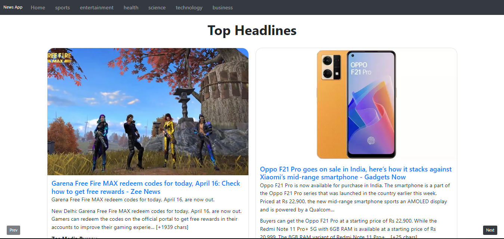

# News App Using React JS

This project was bootstrapped with [Create React App](https://github.com/facebook/create-react-app).

## Screenshots

## Details

This project is made using HTML CSS and ReactJS
This app fetches latest news accross coutries.

Different categories using React Routing,
Infinite scrolling feature,
Pagination

## Environment Variables

To run this project, you will need to add the following environment variables to your .env.local file

`REACT_APP_NEWS_API_KEY`

### `npm start`

Runs the app in the development mode.\
Open [http://localhost:3000](http://localhost:3000) to view it in your browser.

The page will reload when you make changes.\
You may also see any lint errors in the console.

### `npm run build`

Builds the app for production to the `build` folder.\
It correctly bundles React in production mode and optimizes the build for the best performance.

The build is minified and the filenames include the hashes.\
Your app is ready to be deployed!

